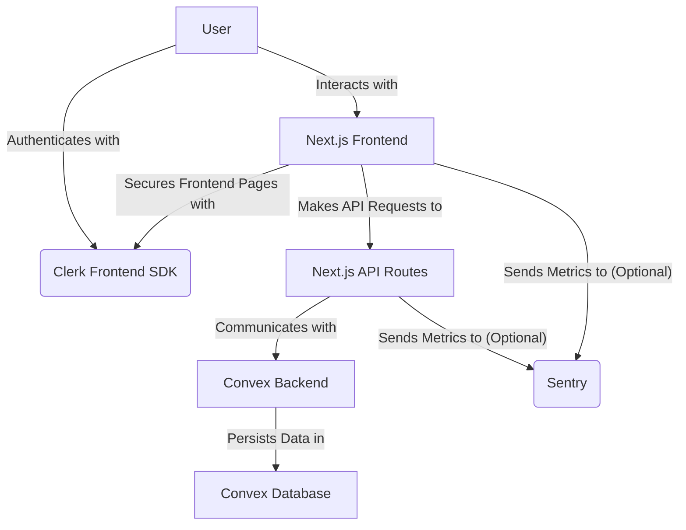
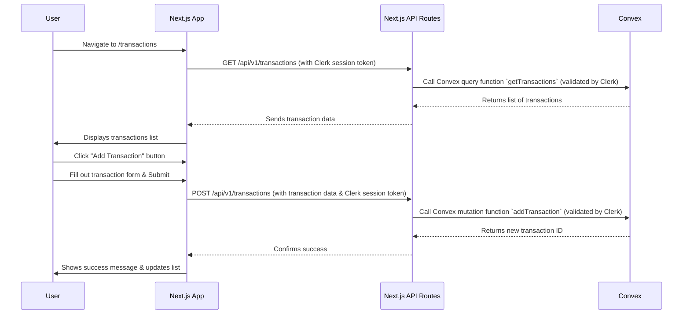

<!--
  Generated by AI-Powered README Generator
  Repository: https://github.com/WomB0ComB0/hackmit-2024
  Generated: 2025-11-21T09:52:16.467Z
  Format: md
  Style: comprehensive
-->

# 🚀 HackMIT 2024 Project

A modern, full-stack financial management and analytics platform built for HackMIT 2024. Streamline your financial oversight with intuitive dashboards, transaction tracking, and powerful reporting, powered by Next.js, Clerk, and Convex.

[](https://github.com/WomB0ComB0/hackmit-2024/actions/workflows/lint.yml)
[](https://github.com/WomB0ComB0/hackmit-2024/actions/workflows/testing.yml)
[](https://opensource.org/licenses/MIT)
[](https://www.typescriptlang.org/)
[](https://github.com/WomB0ComB0/hackmit-2024/releases/tag/v1.0.0)

---

## 🧭 Table of Contents

- [🚀 HackMIT 2024 Project](#-hackmit-2024-project)
  - [🧭 Table of Contents](#-table-of-contents)
  - [✨ Overview](#-overview)
  - [🌟 Feature Highlights](#-feature-highlights)
  - [🏗️ Architecture & Design](#️-architecture--design)
    - [High-Level Component Diagram](#high-level-component-diagram)
    - [Architectural Breakdown](#architectural-breakdown)
    - [Technology Stack](#technology-stack)
  - [🚀 Getting Started](#-getting-started)
    - [Prerequisites](#prerequisites)
    - [Installation Steps](#installation-steps)
    - [Configuration](#configuration)
    - [Running the Application](#running-the-application)
      - [Development Mode](#development-mode)
      - [Production Mode (with Docker)](#production-mode-with-docker)
  - [💡 Usage & Workflows](#-usage--workflows)
    - [User Authentication Flow](#user-authentication-flow)
    - [Transaction Management Workflow](#transaction-management-workflow)
    - [API Usage Examples](#api-usage-examples)
  - [🛠️ Interactivity & Navigation](#️-interactivity--navigation)
  - [⚠️ Limitations, Known Issues & Future Roadmap](#️-limitations-known-issues--future-roadmap)
    - [Current Limitations](#current-limitations)
    - [Known Issues](#known-issues)
    - [Future Roadmap](#future-roadmap)
  - [🤝 Contributing & Development Guidelines](#-contributing--development-guidelines)
    - [How to Contribute](#how-to-contribute)
    - [Branching & Pull Request Guidelines](#branching--pull-request-guidelines)
    - [Code Style & Quality](#code-style--quality)
    - [Testing](#testing)
    - [Development Environment Setup](#development-environment-setup)
  - [📄 License, Credits & Contact](#-license-credits--contact)
    - [License](#license)
    - [Acknowledgments & Credits](#acknowledgments--credits)
    - [Contact](#contact)
  - [📚 Appendix](#-appendix)
    - [Changelog](#changelog)
    - [Frequently Asked Questions (FAQ)](#frequently-asked-questions-faq)
    - [Troubleshooting Guide](#troubleshooting-guide)
    - [API Reference](#api-reference)

---

## ✨ Overview

The **HackMIT 2024 Project** is a cutting-edge web application designed to empower users with robust financial tracking and insightful analytics. Born from the innovative spirit of HackMIT, this platform provides a seamless experience for managing transactions, accounts, and generating critical reports, helping users gain a clear understanding of their financial health.

**Purpose & Goals:**
- **Centralized Financial Management:** Offer a single, intuitive platform to view and manage all financial transactions and accounts.
- **Data-Driven Insights:** Provide dashboards and reports that transform raw financial data into actionable insights.
- **Modern User Experience:** Deliver a fast, responsive, and visually appealing interface using the latest web technologies.
- **Scalable & Secure Foundation:** Build upon a secure authentication system (Clerk) and a powerful, serverless backend (Convex) for reliability and future growth.

**Why it matters / Problem it solves:**
Many individuals and small businesses struggle with disparate financial tools, manual tracking, or overly complex enterprise solutions. This project aims to bridge that gap by offering an accessible, yet powerful, alternative for personal and small-scale financial management, enabling better decision-making through clear visualization and organization of financial data.

**Target Audience:**
- Individuals seeking to gain better control over their personal finances.
- Small businesses and freelancers requiring simple, yet effective, transaction and account management.
- Developers interested in a modern full-stack application leveraging Next.js, Clerk, and Convex.

[⬆️ Back to Top](#-table-of-contents)

---

## 🌟 Feature Highlights

This application comes packed with features designed to simplify your financial life:

-   **User Authentication & Security** ✅
    *   Secure and seamless user sign-up and sign-in powered by Clerk.
    *   Support for multiple authentication methods (e.g., email/password, social logins).
    *   Session management and robust security features out-of-the-box.

-   **Comprehensive Transaction Management** 💸
    *   **Create, Read, Update, Delete (CRUD) Transactions:** Easily add new transactions, view existing ones, modify details, or remove them.
    *   **Categorization:** Assign categories to transactions for better organization and analysis.
    *   **Filtering & Sorting:** Efficiently search and filter transactions by date, amount, category, or status.

-   **Account Overview** 🏦
    *   **Account Management:** Track multiple financial accounts in one place.
    *   **Balance Monitoring:** Get a quick glance at your account balances and overall financial standing.

-   **Interactive Dashboard** 📊
    *   **Real-time Insights:** A personalized dashboard providing a summary of your financial activity.
    *   **Key Metrics:** View important figures like total income, expenses, and net balance.

-   **Reporting & Analytics** 📈
    *   **Generate Reports:** Create custom reports based on transaction data.
    *   **Data Visualization:** Understand trends and patterns through intuitive charts and graphs.
    *   **Predictive Models (Planned):** Future integration of basic financial modeling capabilities.

-   **Modern User Interface** 🎨
    *   **Responsive Design:** Optimized for various screen sizes (desktop, tablet, mobile) using Tailwind CSS and Shadcn/ui.
    *   **Dark Mode Support:** Switch between light and dark themes for comfortable viewing.
    *   **Accessible Components:** Built with accessibility best practices in mind.

-   **Performance & Reliability** ⚡
    *   **Next.js App Router:** Leverages the latest Next.js features for optimal performance and server-side rendering.
    *   **Bun Runtime:** Utilizes Bun for lightning-fast package management and runtime execution.
    *   **Progressive Web App (PWA) Capabilities:** Installable web application with offline support for an app-like experience.

<details>
<summary>💡 **Tip: Explore the Dashboard!**</summary>
The dashboard (`/dashboard`) is your command center. It's designed to give you an immediate understanding of your financial situation. Don't forget to add some initial transactions to see it come to life!
</details>

[⬆️ Back to Top](#-table-of-contents)

---

## 🏗️ Architecture & Design

The HackMIT 2024 Project adopts a modern, decoupled architecture, leveraging a robust full-stack approach that combines the power of Next.js for the frontend, Clerk for authentication, and Convex for a real-time, serverless backend.

### High-Level Component Diagram

This diagram illustrates the primary components of the application and how they interact.



### Architectural Breakdown

1.  **Frontend (Next.js Application):**
    *   **Framework:** Built with [Next.js](https://nextjs.org/) using the App Router for optimal performance, server-side rendering (SSR), static site generation (SSG), and API routes.
    *   **User Interface:** Utilizes [React](https://react.dev/) for component-based UI development, styled with [Tailwind CSS](https://tailwindcss.com/) and [Shadcn/ui](https://ui.shadcn.com/) components for a consistent and modern look and feel.
    *   **Authentication Integration:** Integrates [Clerk.dev](https://clerk.com/) for user authentication, providing secure sign-up, sign-in, and user profile management directly within the frontend.
    *   **PWA:** Configured as a Progressive Web App, enabling offline capabilities and installability.

2.  **API Gateway (Next.js API Routes):**
    *   **Backend for Frontend (BFF):** Next.js API Routes (`src/app/api`) act as an API gateway, providing structured endpoints (`/api/v1/transactions`, `/api/v1/user`) for the frontend to interact with the backend services.
    *   **Data Validation:** Implements schema validation (e.g., using Zod) for incoming API requests to ensure data integrity.
    *   **Authentication Middleware:** Integrates Clerk's server-side authentication to protect API routes, ensuring only authenticated users can access sensitive data.

3.  **Backend (Convex.dev):**
    *   **Serverless Backend:** [Convex](https://www.convex.dev/) serves as the real-time, serverless backend-as-a-service, handling data storage, real-time updates, and server-side functions.
    *   **Database:** Convex provides a reactive database, abstracting away traditional database management.
    *   **Functions (`myFunctions.ts`):** Defines server-side functions in TypeScript (`convex/myFunctions.ts`) that handle business logic, data mutations, and queries, accessible from both frontend and Next.js API routes.
    *   **Authentication Backend:** Configured to work seamlessly with Clerk, validating user identities for Convex function calls.

### Technology Stack

| Category            | Technology           | Description                                                                 |
| :------------------ | :------------------- | :-------------------------------------------------------------------------- |
| **Frontend**        | Next.js              | React framework for building user interfaces with SSR/SSG.                  |
|                     | React                | JavaScript library for building interactive UIs.                            |
|                     | TypeScript           | Statically typed superset of JavaScript, enhancing code quality.            |
|                     | Tailwind CSS         | Utility-first CSS framework for rapid UI development.                       |
|                     | Shadcn/ui            | Reusable, accessible UI components built on Radix UI and Tailwind CSS.      |
|                     | `@ducanh2912/next-pwa` | PWA integration for Next.js.                                                |
| **Backend / DB**    | Convex.dev           | Serverless backend-as-a-service with a real-time, reactive database.        |
| **Authentication**  | Clerk.dev            | User authentication and authorization service.                              |
| **Package Manager** | Bun                  | Fast all-in-one JavaScript runtime, bundler, and package manager.           |
| **Code Quality**    | Biome.js             | Fast formatter and linter for JavaScript, TypeScript, JSON, and more.       |
|                     | Stylelint            | A mighty, modern linter that helps you avoid errors and enforce conventions in your styles. |
| **Testing**         | Playwright           | End-to-end testing framework for modern web apps.                           |
|                     | Vitest               | Fast unit and component testing framework.                                  |
| **Monitoring**      | Sentry.io            | Error tracking and performance monitoring.                                  |
| **Linting/Build**   | MillionLint          | Helps identify and fix performance issues in React applications.            |
|                     | `@next/bundle-analyzer` | Visualizes the size of webpack output files with an interactive zoomable treemap. |

[⬆️ Back to Top](#-table-of-contents)

---

## 🚀 Getting Started

Follow these steps to get the HackMIT 2024 Project up and running on your local machine.

### Prerequisites

Before you begin, ensure you have the following installed:

-   **Bun**: Recommended package manager and JavaScript runtime.
    *   [Installation Guide](https://bun.sh/docs/installation)
-   **Git**: For cloning the repository.
    *   [Installation Guide](https://git-scm.com/book/en/v2/Getting-Started-Installing-Git)
-   **Node.js** (Optional, if not using Bun for runtime): v18.x or higher.

### Installation Steps

1.  **Clone the repository:**

    ```bash
    git clone https://github.com/WomB0ComB0/hackmit-2024.git
    cd hackmit-2024
    ```

2.  **Install dependencies using Bun:**

    ```bash
    bun install
    ```

    _Alternatively, if you prefer npm or yarn:_
    ```bash
    npm install
    # or
    yarn install
    ```

### Configuration

The application requires several environment variables for Clerk authentication, Convex backend, and Sentry monitoring.

1.  **Create a `.env.local` file:**
    Copy the `.env.example` file and rename it to `.env.local` in the project root:

    ```bash
    cp .env.example .env.local
    ```

2.  **Populate environment variables:**
    Edit the `.env.local` file with your respective keys and URLs.

    ```ini
    # Environment variables from env.d.ts:
    # ANALYZE=true # Uncomment to enable bundle analyzer
    
    # Clerk.dev Configuration
    NEXT_PUBLIC_CLERK_PUBLISHABLE_KEY="pk_test_..." # Your Clerk Publishable Key
    CLERK_SECRET_KEY="sk_test_..."             # Your Clerk Secret Key
    CLERK_JWT_ISSUER_DOMAIN="https://clerk.yourdomain.com" # Your Clerk JWT Issuer Domain (e.g., https://jolly-frog-74.clerk.accounts.dev)

    # Convex.dev Configuration
    NEXT_PUBLIC_CONVEX_URL="https://your-deployment-name.convex.cloud" # Your Convex Deployment URL
    CONVEX_DEPLOYMENT="your-deployment-name" # Your Convex deployment name (e.g., brave-antelope-123)
    
    # Sentry.io Configuration (Optional for error tracking)
    SENTRY_AUTH_TOKEN="your_sentry_auth_token" # Sentry Auth Token for CLI
    
    # API URL (If deploying to a custom domain, otherwise it defaults to relative)
    # NEXT_PUBLIC_API_URL="http://localhost:3000" # For local development
    ```

    *   **Clerk:** Sign up at [Clerk.dev](https://clerk.com/) to get your `NEXT_PUBLIC_CLERK_PUBLISHABLE_KEY`, `CLERK_SECRET_KEY`, and `CLERK_JWT_ISSUER_DOMAIN`.
    *   **Convex:** Sign up at [Convex.dev](https://www.convex.dev/). Create a new project, deploy your functions, and copy your `NEXT_PUBLIC_CONVEX_URL` and `CONVEX_DEPLOYMENT`. The `convex/` directory contains the Convex functions.
    *   **Sentry:** If you wish to use Sentry for error tracking, sign up at [Sentry.io](https://sentry.io/) and configure your project.

<details>
<summary>🔍 **Detailed Convex Setup**</summary>

1.  **Install Convex CLI:**
    ```bash
    npm install -g convex
    ```
2.  **Login to Convex:**
    ```bash
    convex auth login
    ```
    This will open your browser to log in.
3.  **Initialize Convex Project:**
    In the `convex/` directory, run:
    ```bash
    convex init
    ```
    Follow the prompts to connect to your Convex project. If you don't have one, it will guide you to create one.
4.  **Deploy Functions:**
    From the project root (`hackmit-2024/`):
    ```bash
    convex deploy
    ```
    This will deploy the functions defined in `convex/myFunctions.ts` to your Convex backend. This command also usually prints your `NEXT_PUBLIC_CONVEX_URL` and `CONVEX_DEPLOYMENT`.
</details>

### Running the Application

#### Development Mode

To run the application in development mode with hot-reloading:

```bash
bun run dev
```

The application will be accessible at `http://localhost:3000`.

#### Production Mode (with Docker)

For a production-ready environment, you can use the provided `Dockerfile`.

1.  **Build the Docker image:**

    ```bash
    docker build -t hackmit-2024 .
    ```

2.  **Run the Docker container:**

    ```bash
    docker run -p 3000:3000 hackmit-2024
    ```

    The application will be accessible at `http://localhost:3000`. Ensure your `.env.local` variables are correctly set for the production build, or pass them as environment variables to the `docker run` command.

<details>
<summary>⚙️ **Production with `bun run start`**</summary>

If you prefer to run a production build without Docker:

1.  **Build the Next.js application:**
    ```bash
    bun run build
    ```
2.  **Start the production server:**
    ```bash
    bun run start
    ```
</details>

[⬆️ Back to Top](#-table-of-contents)

---

## 💡 Usage & Workflows

This section guides you through common usage scenarios and workflows within the application.

### User Authentication Flow

1.  **Sign Up:**
    *   Navigate to `/sign-up`.
    *   Enter your email and password, or use a social login option (e.g., Google).
    *   Complete any verification steps required by Clerk.
    *   Upon successful registration, you will be redirected to the dashboard (`/dashboard`).

2.  **Sign In:**
    *   Navigate to `/sign-in`.
    *   Enter your credentials or choose a social login.
    *   Upon successful login, you will be redirected to the dashboard.

3.  **Manage Account:**
    *   Access your profile settings through the navigation menu.
    *   Update your profile information, manage linked accounts, or change your password.

### Transaction Management Workflow

This is a core functionality of the application, demonstrated by the `/transactions` page.

1.  **View Transactions:**
    *   Once logged in, click on "Transactions" in the sidebar navigation.
    *   You will see a table listing all your recorded transactions.
    *   Use the search and filter options to find specific transactions.

2.  **Add a New Transaction:**
    *   On the Transactions page, locate the "Add Transaction" button (or similar).
    *   A form will appear where you can enter:
        *   **Description:** A brief detail of the transaction.
        *   **Amount:** The monetary value.
        *   **Type:** Income or Expense.
        *   **Category:** Select from predefined categories (e.g., Food, Salary, Rent).
        *   **Date:** The date of the transaction.
    *   Submit the form to save the transaction. It will instantly appear in your list.

3.  **Edit an Existing Transaction:**
    *   Find the transaction you wish to edit in the list.
    *   Click on the "Edit" icon/button next to the transaction.
    *   Modify the fields in the pre-filled form.
    *   Save your changes.

4.  **Delete a Transaction:**
    *   Locate the transaction to delete.
    *   Click on the "Delete" icon/button.
    *   Confirm the deletion in the prompt.



### API Usage Examples

The application exposes a RESTful API via Next.js API Routes (`/api/v1/`). All API endpoints are protected by Clerk authentication. You'll need an authenticated session (e.g., by logging in through the frontend) or a valid Clerk session token to interact with them.

<details>
<summary>💡 **Tip: Getting an Auth Token for API Testing**</summary>
You can usually inspect network requests in your browser's developer tools after logging in to find a `__session` cookie or a `Authorization: Bearer` token in requests made by the frontend to the backend. For local development, you might simulate this.
</details>

#### Get All Transactions

```bash
curl -X GET \
  http://localhost:3000/api/v1/transactions \
  -H 'Content-Type: application/json' \
  -H 'Authorization: Bearer <YOUR_CLERK_SESSION_TOKEN>'
```

_Example Response:_
```json
[
  {
    "id": "123",
    "description": "Groceries",
    "amount": -50.25,
    "type": "expense",
    "category": "Food",
    "date": "2024-03-15T10:00:00Z",
    "userId": "user_abc123"
  },
  {
    "id": "124",
    "description": "Freelance Payment",
    "amount": 500.00,
    "type": "income",
    "category": "Work",
    "date": "2024-03-10T14:30:00Z",
    "userId": "user_abc123"
  }
]
```

#### Create a New Transaction

```bash
curl -X POST \
  http://localhost:3000/api/v1/transactions \
  -H 'Content-Type: application/json' \
  -H 'Authorization: Bearer <YOUR_CLERK_SESSION_TOKEN>' \
  -d '{
    "description": "Dinner with friends",
    "amount": -75.00,
    "type": "expense",
    "category": "Social",
    "date": "2024-03-20T19:00:00Z"
  }'
```

_Example Response:_
```json
{
  "id": "125",
  "description": "Dinner with friends",
  "amount": -75,
  "type": "expense",
  "category": "Social",
  "date": "2024-03-20T19:00:00Z",
  "userId": "user_abc123"
}
```

[⬆️ Back to Top](#-table-of-contents)

---

## 🛠️ Interactivity & Navigation

This README is designed to be highly interactive and easy to navigate:

-   **Table of Contents:** Use the "Table of Contents" at the top to jump to any major section.
-   **Internal Links:** Throughout the document, you'll find links (e.g., `[⬆️ Back to Top](#-table-of-contents)`) to quickly return to the TOC or jump to related sections.
-   **Collapsible Sections (`<details>` tags):** Look for sections with a small arrow next to them. Clicking these will expand or collapse detailed information, keeping the document clean and scannable.
-   **Embedded Diagrams:** Mermaid diagrams are used to visually explain architectural components and workflows, providing a clear visual aid. These are rendered directly in compatible Markdown viewers.

[⬆️ Back to Top](#-table-of-contents)

---

## ⚠️ Limitations, Known Issues & Future Roadmap

As a project developed within the scope of HackMIT, there are certain limitations and a clear vision for future enhancements.

### Current Limitations

*   **Basic Reporting:** Current reporting features are foundational, focusing on transaction lists and simple summaries. Advanced analytics and customizable report generation are future goals.
*   **Single-User Focus:** The application is primarily designed for individual use. Multi-user accounts with role-based access control are not yet implemented.
*   **Limited Integrations:** No direct integrations with banks or external financial services. All transactions must be entered manually.
*   **Convex Free Tier Constraints:** While powerful, the free tier of Convex may have limitations on data storage, throughput, and function calls that could impact very high-volume usage.
*   **Error Handling (Edge Cases):** While general error handling is present, specific edge cases or complex failure scenarios might not be fully robust.

### Known Issues

*   **Performance on Large Data Sets:** With an extremely large number of transactions (e.g., tens of thousands), some UI components might experience minor performance degradation. This will be addressed with pagination and virtualized lists in future updates.
*   **UI Responsiveness for Specific Devices:** While generally responsive, some minor layout issues might appear on very specific browser/device combinations.
*   **Offline Functionality:** While PWA is enabled, robust offline data synchronization is not yet fully implemented for all features.

### Future Roadmap

Our vision for the HackMIT 2024 Project extends far beyond its current state. Here's a glimpse into what's planned:

*   **Advanced Analytics & Visualization:**
    *   Interactive charts (e.g., spending trends, budget vs. actual).
    *   Categorical breakdowns and deeper insights.
    *   Customizable dashboard widgets.
*   **Budgeting Features:**
    *   Set monthly/annual budgets for different categories.
    *   Track progress against budgets with alerts.
*   **Bank Integrations:**
    *   Connect directly to financial institutions for automatic transaction import.
    *   Reconciliation features.
*   **User Management & Roles:**
    *   Support for multiple users within an organization.
    *   Granular role-based access control.
*   **Goal Tracking:**
    *   Set financial goals (e.g., savings goals, debt repayment).
    *   Monitor progress towards these goals.
*   **Notifications & Alerts:**
    *   Customizable alerts for unusual spending, low balances, or approaching deadlines.
*   **Mobile Application:**
    *   Native mobile applications for iOS and Android.
*   **Enhanced API:**
    *   More comprehensive API endpoints for accounts, reports, and other entities.
    *   Webhooks for real-time event notifications.
*   **Machine Learning Models:**
    *   Implement basic predictive models for future spending, cash flow, or investment recommendations (`/models` route hint).

<details>
<summary>💡 **Have a feature request?**</summary>
We'd love to hear your ideas! Please open a new [feature request issue](#-contributing--development-guidelines) on GitHub.
</details>

[⬆️ Back to Top](#-table-of-contents)

---

## 🤝 Contributing & Development Guidelines

We welcome contributions from the community! Whether it's reporting a bug, suggesting a feature, or submitting code, your help makes this project better.

### How to Contribute

1.  **Fork the repository:** Start by forking the `WomB0ComB0/hackmit-2024` repository to your GitHub account.
2.  **Clone your fork:**
    ```bash
    git clone https://github.com/YOUR_USERNAME/hackmit-2024.git
    cd hackmit-2024
    ```
3.  **Create a new branch:** Always work on a new branch for your changes.
    ```bash
    git checkout -b feature/your-feature-name # for new features
    git checkout -b bugfix/issue-description # for bug fixes
    ```
4.  **Make your changes:** Implement your feature or fix the bug.
5.  **Test your changes:** Ensure your changes don't introduce new bugs and existing functionalities remain intact.
    ```bash
    bun run test # for unit/component tests
    bun run test:e2e # for end-to-end tests (requires Playwright setup)
    ```
6.  **Commit your changes:** Write clear and concise commit messages.
    ```bash
    git add .
    git commit -m "feat: Add new transaction filtering option"
    ```
7.  **Push your branch:**
    ```bash
    git push origin feature/your-feature-name
    ```
8.  **Open a Pull Request (PR):**
    *   Go to the original repository on GitHub.
    *   You'll see a prompt to open a PR from your branch.
    *   Provide a clear title and detailed description of your changes. Link to any relevant issues.

### Branching & Pull Request Guidelines

*   **Main Branch:** The `main` branch always represents the latest stable and deployed version.
*   **Development Branch:** All new features and bug fixes should be merged into `main` (or a `develop` branch if one is established for continuous integration).
*   **Feature Branches:** Create descriptive branches (e.g., `feature/add-dark-mode`, `bugfix/fix-transaction-edit`).
*   **Pull Request Reviews:** All PRs require at least one review before merging.
*   **CI/CD:** Ensure all CI checks (linting, tests) pass before requesting a review.

### Code Style & Quality

*   **Biome.js:** We use [Biome.js](https://biomejs.dev/) for consistent code formatting and linting.
    *   Run `bun run format` to automatically format your code.
    *   Run `bun run lint` to check for linting errors.
*   **TypeScript:** All new code should be written in TypeScript, leveraging its type safety.
*   **ESLint/Stylelint:** Additional linting is configured for JavaScript/TypeScript and CSS.
*   **Conventions:** Follow existing code conventions, especially for Next.js, React, and Tailwind CSS.

### Testing

*   **Unit/Component Tests:** Written using [Vitest](https://vitest.dev/). Found in `src/**/*.test.ts/tsx`.
    *   Run all tests: `bun run test`
*   **End-to-End Tests:** Written using [Playwright](https://playwright.dev/). Found in `e2e/`.
    *   Run e2e tests: `bun run test:e2e`
    *   Update snapshots: `bun run test:e2e --update-snapshots`

### Development Environment Setup

For a smooth development experience, ensure you have:
*   VS Code with recommended extensions (ESLint, Prettier, Tailwind CSS Intellisense).
*   Bun installed.
*   Convex CLI configured and connected to your project.

[⬆️ Back to Top](#-table-of-contents)

---

## 📄 License, Credits & Contact

### License

This project is licensed under the **MIT License**. You are free to use, modify, and distribute this software, provided you include the original copyright and license notice.

See the [LICENSE](LICENSE) file for more details.

### Acknowledgments & Credits

We extend our gratitude to the following projects and individuals for their invaluable contributions and foundational technologies:

*   **[T3 Stack](https://create.t3.gg/)**: The original boilerplate for this project.
*   **[Next.js](https://nextjs.org/)**: The React framework for production.
*   **[Clerk.dev](https://clerk.com/)**: For secure and developer-friendly authentication.
*   **[Convex.dev](https://www.convex.dev/)**: For the real-time, serverless backend.
*   **[Tailwind CSS](https://tailwindcss.com/)**: For the utility-first CSS framework.
*   **[Shadcn/ui](https://ui.shadcn.com/)**: For beautiful and accessible UI components.
*   **[Bun](https://bun.sh/)**: For the incredibly fast JavaScript runtime and package manager.
*   **[Biome.js](https://biomejs.dev/)**: For code formatting and linting.
*   **[Sentry](https://sentry.io/)**: For error tracking and performance monitoring.
*   **[MillionLint](https://million.dev/)**: For React performance optimization.
*   **[Playwright](https://playwright.dev/) & [Vitest](https://vitest.dev/)**: For robust testing tools.
*   **HackMIT 2024 Organizers**: For hosting an inspiring event!

### Contact

For questions, suggestions, or collaborations, feel free to reach out:

*   **GitHub Profile:** [@WomB0ComB0](https://github.com/WomB0ComB0)
*   **Issues:** Please open an issue on the [GitHub repository](https://github.com/WomB0ComB0/hackmit-2024/issues) for bugs or feature requests.

[⬆️ Back to Top](#-table-of-contents)

---

## 📚 Appendix

### Changelog

**v1.0.0 - Initial Release (HackMIT 2024 Submission)**
*   Core application setup with Next.js, Clerk, Convex.
*   User authentication (Sign-up, Sign-in).
*   Transaction CRUD operations.
*   Basic dashboard view.
*   Responsive UI with Shadcn/ui and Tailwind CSS.
*   Docker support for deployment.
*   Comprehensive testing setup with Playwright and Vitest.
*   PWA capabilities.

### Frequently Asked Questions (FAQ)

<details>
<summary>❓ **How do I reset my password?**</summary>
Since authentication is handled by Clerk, you can use their built-in password reset flow from the sign-in page, typically via an "Forgot Password?" link.
</details>

<details>
<summary>❓ **Is my data secure?**</summary>
Yes. We use Clerk for authentication, which provides industry-standard security practices. Your data is stored in Convex, which also follows robust security protocols. Always ensure your environment variables (especially `CLERK_SECRET_KEY`) are kept secret.
</details>

<details>
<summary>❓ **Can I export my transaction data?**</summary>
Currently, there isn't a direct export feature in the UI. However, if you have access to the Convex backend, you can potentially query and export your data directly. This feature is planned for future UI updates.
</details>

<details>
<summary>❓ **What if I encounter a "Convex deployment not found" error?**</summary>
Ensure that your `NEXT_PUBLIC_CONVEX_URL` and `CONVEX_DEPLOYMENT` environment variables are correctly set in `.env.local` and match your actual Convex project deployment. Also, confirm you've run `convex deploy` successfully from the `convex/` directory.
</details>

### Troubleshooting Guide

<details>
<summary>🐛 **"Module not found" or "Cannot find package" errors during `bun install`**</summary>
*   **Check Bun version:** Ensure you have a recent version of Bun.
*   **Clear cache:** Try `bun install --force` or `bun cache clean` followed by `bun install`.
*   **Node modules:** Ensure there are no conflicting `node_modules` if you previously used `npm` or `yarn`. Remove `node_modules` and `bun.lockb` and try `bun install` again.
</details>

<details>
<summary>🚨 **Clerk authentication issues (e.g., "Invalid Publishable Key")**</summary>
*   **Environment variables:** Double-check `NEXT_PUBLIC_CLERK_PUBLISHABLE_KEY`, `CLERK_SECRET_KEY`, and `CLERK_JWT_ISSUER_DOMAIN` in your `.env.local` file. They must exactly match the values from your Clerk dashboard.
*   **Redirect URLs:** Ensure your Clerk application's "Allowed Redirect URLs" (in Clerk dashboard) include `http://localhost:3000/*` for local development.
</details>

<details>
<summary>⚠️ **Next.js build errors after pulling changes**</summary>
*   **Dependencies:** Run `bun install` to ensure all new or updated dependencies are installed.
*   **Type errors:** TypeScript errors might prevent the build. Address any reported type errors. `bun run lint` might help identify issues.
*   **Cache:** Clear Next.js cache by deleting the `.next` folder in the project root and then re-run `bun run build`.
</details>

### API Reference

While a full interactive API documentation (e.g., Swagger/OpenAPI) is not yet integrated, the key endpoints are:

*   **`GET /api/v1/health`**: Simple health check.
*   **`GET /api/v1/user`**: Retrieve information about the authenticated user.
*   **`GET /api/v1/user/[id]`**: Retrieve information for a specific user ID.
*   **`GET /api/v1/transactions`**: Fetch all transactions for the authenticated user.
*   **`POST /api/v1/transactions`**: Create a new transaction.
    *   _Request Body (JSON):_ `{ description: string, amount: number, type: 'income' | 'expense', category: string, date: string (ISO 8601) }`
*   **`GET /api/v1/transactions/[id]`**: Fetch a specific transaction by ID.
*   **`PUT /api/v1/transactions/[id]`**: Update an existing transaction by ID.
    *   _Request Body (JSON):_ `{ description?: string, amount?: number, type?: 'income' | 'expense', category?: string, date?: string (ISO 8601) }`
*   **`DELETE /api/v1/transactions/[id]`**: Delete a transaction by ID.

For detailed schema information, refer to `src/app/api/v1/transactions/schema/schema.ts` and `src/app/api/v1/user/schema/schema.ts`.

[⬆️ Back to Top](#-table-of-contents)